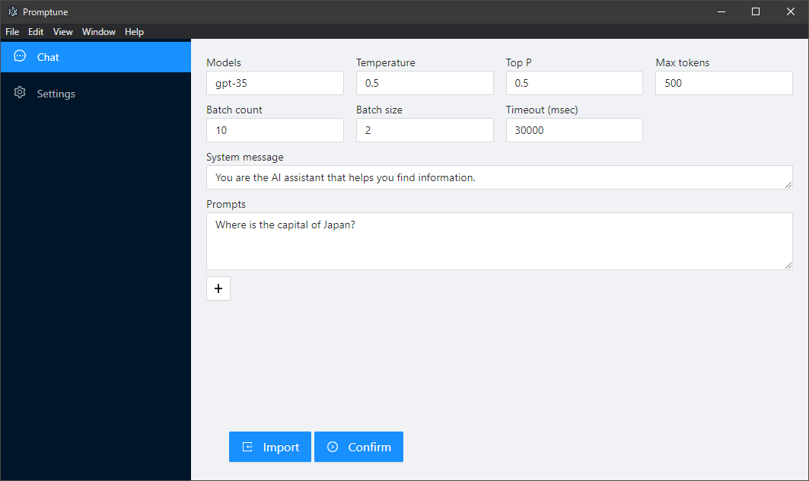
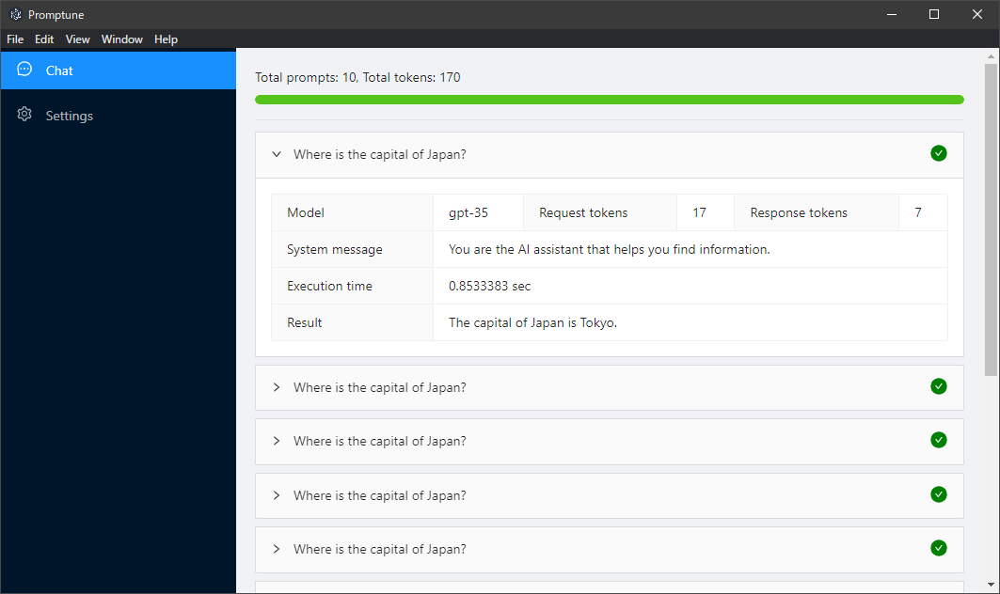

# Promptune
Promptune allows multiple prompt patterns to run in parallel.

NOTE: This tool uses Chat completions API (not Completions API).




## Start & Build
Install [ElectronNet.CLI](https://www.nuget.org/packages/ElectronNET.CLI/) and execute the following commands.

```
> electronize start
```

See also:

- [ElectronNET/Electron.NET: :electron: Build cross platform desktop apps with ASP.NET Core (Razor Pages, MVC, Blazor).](https://github.com/ElectronNET/Electron.NET)

## Usage
Before use, configure the API endpoint and secret key in the Settings tab.

### Options

|Name|Description|
|:-|:-|
|Models|Model or deploy name to use. Multiple models can be specified with commas.|
|Temperature|Templerature parameter.|
|Top P|Top P parameter.|
|Max tokens|Token limit of response.|
|Batch count|Number of iterations.|
|Batch size|Number of parallel runs.|
|Timeout (msec)|Generation timeout in msec.|

### Import
Prompts can be imported from CSV. The file will only read the first column.

## Author
- Takumi Yamada (Twitter: [@tackme31](https://twitter.com/tackme31))